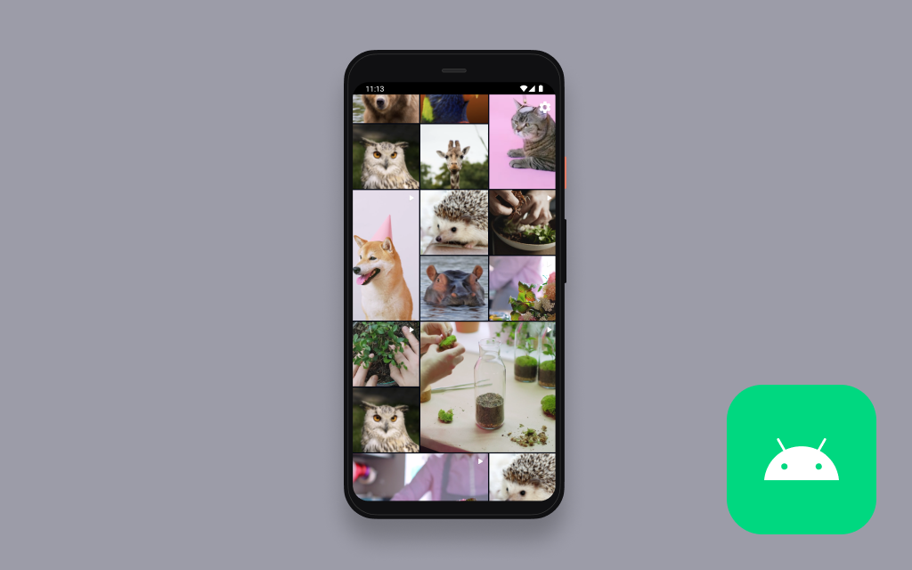

# Amazon IVS Grid Feed for Android Demo

A demo Android application in Kotlin intended as an educational tool to demonstrate how you can build a grid feed of autoplaying videos with [Amazon IVS](https://www.ivs.rocks/).

**This project is intended for education purposes only and not for production usage.**

## Setup

1. Clone the repository to your local machine.
2. Open the repository in [Android Studio](https://developer.android.com/studio), or an IDE of your choice.
3. Run the application on an emulated device or a physical device running API level 33 or later.

## Known Issues

- This app has only been tested on devices running Android 13 and API level 33 or later. While this app may work on older versions of Android, they have not been extensively tested.
- A list of known issues for the Amazon IVS Player SDK is available on the following page: [Amazon IVS Player SDK: Android Guide](https://docs.aws.amazon.com/ivs/latest/LowLatencyUserGuide/android-issues.html)

## About Amazon IVS

Amazon Interactive Video Service (Amazon IVS) is a managed live streaming solution that is quick and easy to set up, and ideal for creating interactive video experiences. [Learn more](https://aws.amazon.com/ivs/).

- [Amazon IVS docs](https://docs.aws.amazon.com/ivs/)
- [User Guide](https://docs.aws.amazon.com/ivs/latest/userguide/)
- [API Reference](https://docs.aws.amazon.com/ivs/latest/APIReference/)
- [Setting Up for Streaming with Amazon Interactive Video Service](https://aws.amazon.com/blogs/media/setting-up-for-streaming-with-amazon-ivs/)
- [Learn more about Amazon IVS on IVS.rocks](https://ivs.rocks/)
- [View more demos like this](https://ivs.rocks/examples)

## License

This project is licensed under the MIT-0 License. See the LICENSE file.
